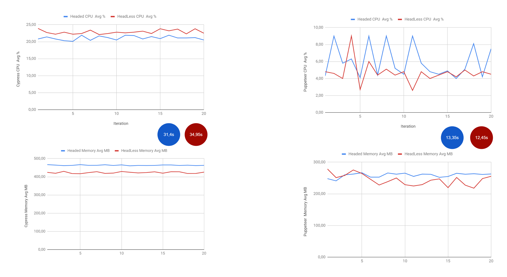

## Cypress and Puppeteer  + Jest


Para ejecutar este proyecto de pruebas primero debe intalar las dependencias con

````
npm install
````

una vez instaladas las dependencias es posible ejecutar las pruebas para cada framework:

## Cypress
````
npm run test:cypress
````

La configuración de Cypress para usar ``Headed`` es usando el parámetro `--headed`


## Puppeteer
````
npm run test:puppeteer
````
Por su parte la configuración de Puppeteer para usar ``Headed`` es incluyendo una configuración al instanciar el browser

Ejemplo:
````$xslt

const puppeteer = require('puppeteer');
let browser, page;
describe('Form in error state', () => {
    beforeAll(async () => {
        browser = await puppeteer.launch({
            headless: false,
            launch: {},
            browserContext: 'default',
            exitOnPageError: true,
            args: ['--no-sandbox', '--disable-setuid-sandbox', '--disable-background-timer-throttling', '--disable-backgrounding-occluded-windows', '--disable-renderer-backgrounding']
        });

        page = await browser.newPage();
        await page.goto('https://angular-6-registration-login-example.stackblitz.io/register');

    }, 15000);
````

### Resultados




